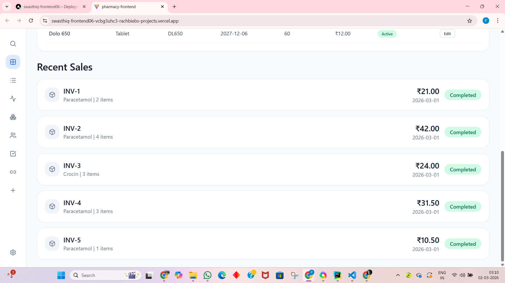
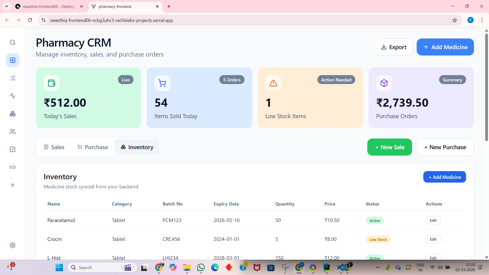
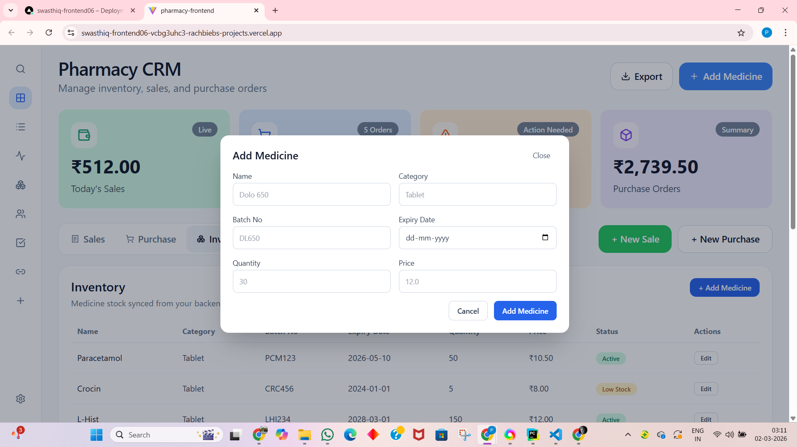

# 🏥 SwasthiQ Pharmacy Management System

A full-stack pharmacy management system built using FastAPI and React.

## 🚀 Live Demo
- Frontend: https://swasthiq-frontend06-vcbg3uhc3-rachbiebs-projects.vercel.app/
- Backend: https://swasthiq-d4kd.onrender.com
- Backend Docs: https://swasthiq-d4kd.onrender.com/docs

## 🛠 Tech Stack
- Frontend: React (Vite)
- Backend: FastAPI
- Database: SQLite
- Deployment: Vercel + Render

## 📦 Features

### Dashboard
- Sales Summary
- Items Sold
- Low Stock Alerts
- Purchase Summary
- Recent Sales

### Inventory
- Add / Update Medicines
- Status tracking (Active, Low Stock, Expired)
- Search & Filter

## 🔗 API Endpoints

### Dashboard
- GET /dashboard/sales-summary
- GET /dashboard/items-sold
- GET /dashboard/low-stock
- GET /dashboard/purchase-summary
- GET /dashboard/recent-sales

### Inventory
- GET /inventory/
- POST /inventory/
- PUT /inventory/{id}
- GET /inventory/search

## ⚙️ Setup

### Backend
```bash
pip install -r requirements.txt
uvicorn app.main:app --reload
```

### Frontend
```bash
npm install
npm run dev
```

## 📸 Screenshots


```md



```

## 💡 Design Decisions
- Used separate sales and purchase summaries for realistic dashboard reporting.
- Implemented dynamic medicine status handling (Active, Low Stock, Out of Stock/Expired via backend logic).
- Designed RESTful APIs with clear separation of dashboard and inventory concerns.

